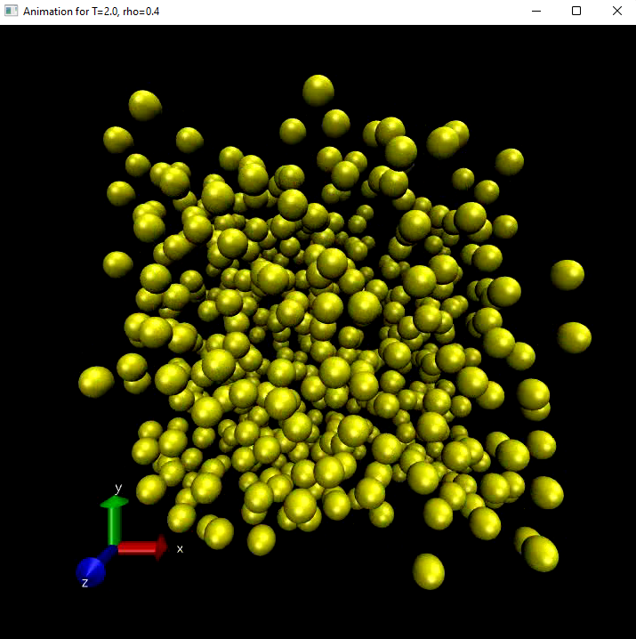
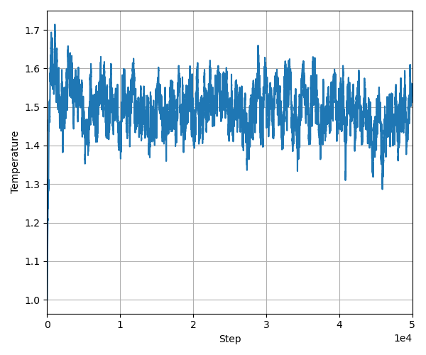

# Streamlit Phase Diagram

  

I made this script for people who wants to use [Phase Diagram](https://github.com/alex180500/open-computational-physics/tree/main/molecular-dynamics) but may prefer a simpler online-based version.

**The code can be run online using this link:** https://share.streamlit.io/alex180500/

All of the code is distributed under the [MIT License](LICENSE) and is free to use for any purpose, please credit me if possible if you want to use it.

## References

Please refer to the amazing [Streamlit documentation](https://docs.streamlit.io) and all the references on [Phase Diagram](https://github.com/alex180500/open-computational-physics/tree/main/molecular-dynamics).

## Dependencies

If you want to run the code locally make sure to have the following packages:
  * **Python 3**
  * **Pandas**
  * **Pillow**
  * **Streamlit**